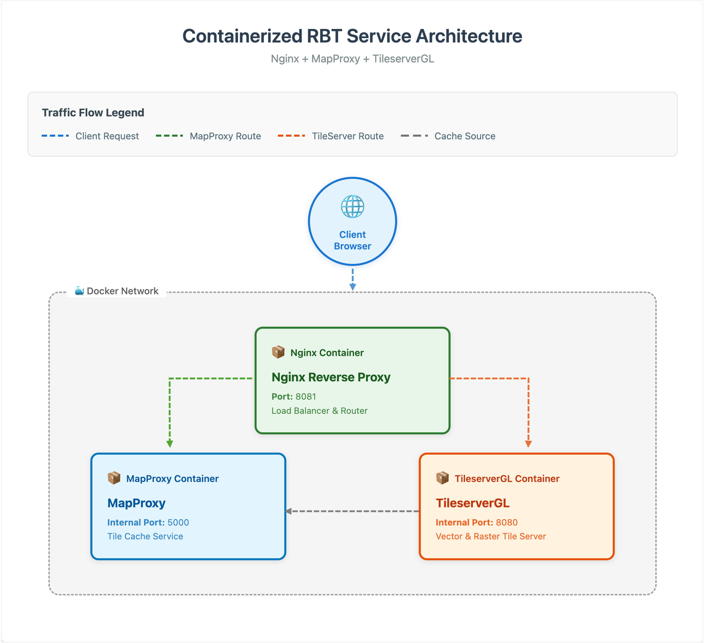
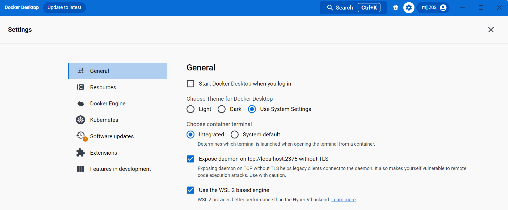

# Releasable Basemap Tiles (RBT)

## What is RBT?

RBT (Releasable Basemap Tiles) is a web application that provides map tiles for military and coalition partners. Think of it like Google Maps, but designed for military use with maps that can be safely shared internationally.

### Why RBT is Better Than Older Map Systems

RBT uses **Vector Tiles** instead of the older **Raster Tiles** (like CADRG - Compressed ARC Digitized Raster Graphics) that the military has traditionally used. Here's why this matters:

**Think of it like this:**

- **Raster tiles (old way)** are like digital photographs of maps - they're made of pixels and have a fixed size and quality
- **Vector tiles (RBT's way)** are like digital drawings made of mathematical shapes and text that can be resized perfectly

**Key Advantages of Vector Tiles:**

🎯 **Better Quality at Any Zoom Level**

- Raster: Text becomes blurry when you zoom in (like enlarging a photo)
- Vector: Text and lines stay crisp at any zoom level

📦 **Smaller File Sizes**

- Raster: Large image files that take up lots of storage and bandwidth
- Vector: Compact mathematical descriptions that are 60-80% smaller

🌐 **Works Better Offline**

- Raster: Need to download many large image files for different zoom levels
- Vector: Download once, works smoothly at all zoom levels

⚡ **Faster Loading**

- Raster: Must load new images when zooming or panning
- Vector: Smooth transitions because data is already there

🎨 **Customizable Appearance**

- Raster: Fixed colors and styles (what you see is what you get)
- Vector: Can change colors, hide/show layers, adjust for day/night use

🔄 **Better for Coalition Sharing**

- Smaller files mean faster transfer over military networks
- Single vector dataset works for multiple use cases (instead of separate raster sets)
- Partners can customize the display for their specific needs

This makes RBT particularly valuable for military operations where bandwidth is limited, storage space is precious, and maps need to work reliably in various conditions.

## What You'll Need

This application runs using Docker, which is like a virtual container that packages everything needed to run the software. Don't worry if you're new to these tools - we'll guide you through each step.

The Releasable Basemap Tiles (RBT) is important because the capability can be easily shared with international coalition partners and doesn't need to go through the current approval process associated with traditional Limited Distribution (LIMDIS) data. The RBT is based on modern technology and provides access to like-in-kind Standard Map Products such as Topographic Map (TM), Joint Operations Graphic (JOG), and Tactical Pilotage Chart (TPC) in Vector Tiles format. This format enables rapid transfer across a network or accessed offline from a tile cache. By implementing simple changes in how modern maps are produced and accessed, international coalition partners will be able to track plans and activities using the same basemaps as U.S. services without delays associated with release of classified information.

## How It Works (Simple Version)

RBT uses several components working together:

- **TileserverGL**: Serves the map tiles (the actual map images)
- **MapProxy**: Helps convert between different map formats  
- **Docker**: Packages everything together so it runs the same on any computer
- **Kubernetes/Docker Compose**: Tools that manage and run the application


# Architecture

RBT is deployed as a containerized application using [TileserverGL](https://github.com/maptiler/tileserver-gl), which uses [MapLibre GL Native](https://maplibre.org/) for server-side rendering and serves vector and raster tiles in **EPSG:3857** (Web Mercator). Additionally, [MapProxy](https://mapproxy.org/) is deployed in front of TileserverGL to cache those raster tiles, exposing them through standard OGC WMS/WMTS endpoints, also in **EPSG:3857**.

This guide documents a **Docker Compose** deployment suitable for a single host (a workstation, VM, or on-premises server) running Windows 11 or Linux. You will need S3 credentials from the RBT team to download the MBTiles data that TileserverGL serves.



# Installation

Before cloning this repo, you will need to ensure **Git**, **Git Large File Storage (LFS)**, **AWSCLI**, and **Docker** are installed and enabled on your system.

## Before You Start


### Computer Requirements

- Windows 11 (via WSL2) or Linux, as documented in this guide. macOS works with the Linux/Docker Desktop instructions but isn't covered step-by-step here.
- Both container images (`maptiler/tileserver-gl` and `ghcr.io/mapproxy/mapproxy/mapproxy`) publish `linux/amd64` and `linux/arm64` builds, so this runs on Intel/AMD and Arm64 hosts alike (including Apple Silicon under Docker Desktop).
- Disk space: enough for the two MBTiles files described in Phase 3 below, **plus** extra headroom for the MapProxy GeoPackage tile cache it builds over time as it fetches and caches tiles from TileserverGL. Ask the RBT team for current file sizes when you receive your S3 credentials -- the datasets are updated periodically, so we don't pin numbers here that would go stale.
- Internet connection for downloading components and the MBTiles data
- Minimum 16GB of RAM recommended
- Minimum 8 cores CPU recommended


### Skills You'll Need

- Basic familiarity with using a terminal/command prompt
- Ability to copy and paste commands
- Don't worry if you're new to this - we'll guide you through each step!


### What If I Get Stuck?

- Each command should be run one at a time
- If you see an error, don't panic - scroll down to our Troubleshooting section
- Commands that start with `sudo` may ask for your password


## Installation Guide


### Phase 1: Get Permission and Credentials

Before starting, you need special access to download the map data:

1. Email [Tom Boggess](Thomas.J.Boggess@usace.army.mil) to request S3 credentials
2. Wait for approval and credentials (this may take a few days)
3. Once you receive credentials, configure AWS CLI by running:
  ```
   aws configure --profile rbt
  ```
   Enter the provided Access Key ID, Secret Access Key, and set the region to `us-east-1`


### Phase 2: Install Required Software

You need to install several tools. Don't worry - we'll explain what each one does:

#### What is AWS CLI?

AWS CLI is a tool that lets you download files from Amazon's cloud storage (where our map data is stored).

#### What is Git?

Git is a tool for downloading and managing code projects. Git LFS handles large files.

#### What is Docker?

Docker packages applications so they run consistently on any computer.

### Phase 3: Download the Map Data

After installing the software and cloning the repository, download the two MBTiles files into `tileserver/data/` using the S3 credentials from Phase 1. The RBT team will give you the exact bucket path; the download commands look like this:

```bash
aws s3 cp s3://<rbt-bucket-path>/TERRAIN.mbtiles tileserver/data/TERRAIN.mbtiles --profile rbt
aws s3 cp s3://<rbt-bucket-path>/RBT.mbtiles tileserver/data/RBT.mbtiles --profile rbt
```

Replace `<rbt-bucket-path>` with the path the RBT team gives you. Both files are required -- `tileserver/config/config.json` references them by these exact names. Confirm both are in place before starting the stack:

```bash
ls -lh tileserver/data/TERRAIN.mbtiles tileserver/data/RBT.mbtiles
```


## Linux Setup

Run the block below that matches your distribution family to install the required software, then run the shared steps that follow on any distribution.

#### **Fedora/RHEL/CentOS:**

```bash
# Download and install AWS CLI
sudo dnf install unzip -y;
curl "https://awscli.amazonaws.com/awscli-exe-linux-x86_64.zip" -o "awscliv2.zip" && \
    unzip awscliv2.zip && \
    sudo ./aws/install

# Remove old Docker versions (if any exist)
sudo dnf remove docker docker-client \
    docker-client-latest docker-common \
    docker-latest docker-latest-logrotate \
    docker-logrotate docker-selinux \
    docker-engine-selinux docker-engine

# Install Docker repository management tools
sudo dnf -y install dnf-plugins-core

# Add Docker's official repository
sudo dnf config-manager \
    --add-repo \
    https://download.docker.com/linux/fedora/docker-ce.repo

# Install Docker, Git, and Git LFS
sudo dnf install docker-ce docker-ce-cli \
    containerd.io docker-buildx-plugin \
    docker-compose-plugin git-all git-lfs
```


#### **Ubuntu/Debian:**

```bash
# Download and install AWS CLI
sudo apt-get update;
sudo apt-get install -y unzip ca-certificates curl gnupg lsb-release;
sudo update-ca-certificates;
curl "https://awscli.amazonaws.com/awscli-exe-linux-x86_64.zip" -o "awscliv2.zip" && \
    unzip awscliv2.zip && \
    sudo ./aws/install;

# Remove old Docker versions (if any exist)
sudo apt-get remove docker docker-engine docker.io containerd runc;

# Add Docker's official repository
sudo mkdir -m 0755 -p /etc/apt/keyrings;
curl -fsSL https://download.docker.com/linux/ubuntu/gpg | sudo gpg --dearmor -o /etc/apt/keyrings/docker.gpg;
echo \
  "deb [arch=$(dpkg --print-architecture) signed-by=/etc/apt/keyrings/docker.gpg] https://download.docker.com/linux/ubuntu $(lsb_release -cs) stable" \
  | sudo tee /etc/apt/sources.list.d/docker.list > /dev/null;
sudo chmod a+r /etc/apt/keyrings/docker.gpg;

# Install Docker, Git, and Git LFS
sudo apt-get update;
sudo apt-get install -y \
    docker-ce docker-ce-cli containerd.io \
    docker-buildx-plugin docker-compose-plugin \
    git-all git-lfs;
```


#### **Shared steps (all distributions):**

```bash
# Enable Git LFS support
git lfs install

# Clone the RBT project
git clone https://github.com/mjj203/agc-rbt.git && \
    cd agc-rbt

# The mapproxy container writes to these directories as uid/gid 1000 --
# the uid baked into the upstream MapProxy image, and also the default
# uid of the first non-root user on most Linux distributions. Check
# your own user's ids with `id -u` and `id -g` if you suspect they
# differ, and substitute below.
sudo chown -R 1000:1000 mapproxy/data mapproxy/locks mapproxy/tile_locks
sudo chmod -R 775 mapproxy/data mapproxy/locks mapproxy/tile_locks nginx/cache nginx/logs nginx/run

# Download the map data (see Phase 3 above) before continuing, then
# start the RBT stack from the agc-rbt directory
docker compose up -d

# Check logs
docker compose logs -f

# Stop the instance
docker compose down --remove-orphans
```


## Windows 11 Setup

RBT runs inside a Linux environment on Windows using **WSL2** (Windows Subsystem for Linux). Whether you choose Docker Desktop or Docker Engine below, every command in this section runs **inside your WSL2 Linux distribution**, not in PowerShell or `cmd.exe`.

### Step 1: Enable WSL2

1. Open PowerShell as Administrator (right-click Start menu -> "Terminal (Admin)" or "Windows PowerShell (Admin)")
2. Run: `wsl --install`
3. Restart your computer when prompted
4. After restart, WSL finishes installing Ubuntu and prompts you to create a Linux username and password

If `wsl --install` isn't available on your system, follow Microsoft's [manual installation steps](https://learn.microsoft.com/en-us/windows/wsl/install-manual) instead. See the [WSL environment setup guide](https://learn.microsoft.com/en-us/windows/wsl/setup/environment#set-up-your-linux-username-and-password) for more on the username/password step.

### Step 2: Give WSL2 enough memory

WSL2 defaults to using **half of your host's RAM** (and 25% of its swap), shared across every distro you run. This stack alone recommends 16GB, so that default is too small on most laptops. Create (or edit) `%UserProfile%\.wslconfig` **in Windows** (i.e. `C:\Users\<you>\.wslconfig` -- not a path inside WSL) with at least:

```ini
[wsl2]
memory=16GB
swap=4GB
```

Then apply the change from PowerShell:

```powershell
wsl --shutdown
```

The new limits take effect the next time you open a WSL2 terminal. See Microsoft's [.wslconfig reference](https://learn.microsoft.com/en-us/windows/wsl/wsl-config) for the full set of options.

### Step 3: Choose Your Docker Setup

**Option A: Docker Engine inside WSL2 (Recommended)** - lighter weight, no separate GUI application. See [Docker Engine in WSL2](#docker-engine-in-wsl2) below.

**Option B: Docker Desktop with WSL2 backend** - adds a GUI and system tray app on top of the same WSL2 engine. See [Docker Desktop with WSL2](#docker-desktop-with-wsl2) below.

Both run the same Linux containers the same way; pick based on whether you want the GUI.

#### Docker Engine in WSL2

Open your WSL2 distribution (search "Ubuntu" in the Start menu) and run:

```bash
# Download and install AWS CLI
sudo apt-get update;
sudo apt-get install -y unzip ca-certificates curl gnupg lsb-release;
sudo update-ca-certificates;
curl "https://awscli.amazonaws.com/awscli-exe-linux-x86_64.zip" -o "awscliv2.zip" && \
    unzip awscliv2.zip && \
    sudo ./aws/install;

# Remove old Docker versions (if any exist)
sudo apt-get remove docker docker-engine docker.io containerd runc;

# Add Docker's official repository
sudo mkdir -m 0755 -p /etc/apt/keyrings;
curl -fsSL https://download.docker.com/linux/ubuntu/gpg | sudo gpg --dearmor -o /etc/apt/keyrings/docker.gpg;
echo \
  "deb [arch=$(dpkg --print-architecture) signed-by=/etc/apt/keyrings/docker.gpg] https://download.docker.com/linux/ubuntu $(lsb_release -cs) stable" \
  | sudo tee /etc/apt/sources.list.d/docker.list > /dev/null;
sudo chmod a+r /etc/apt/keyrings/docker.gpg;

# Install Docker, Git, and Git LFS
sudo apt-get update;
sudo apt-get install -y \
    docker-ce docker-ce-cli containerd.io \
    docker-buildx-plugin docker-compose-plugin \
    git-all git-lfs;

# Start the Docker service
sudo service docker start
```

WSL2 doesn't run background services automatically on every launch by default, so you may need to run `sudo service docker start` each time you open a new WSL2 session -- or enable [systemd support](https://learn.microsoft.com/en-us/windows/wsl/systemd) in `/etc/wsl.conf` to avoid that.

#### Docker Desktop with WSL2

1. Follow Docker's [Windows install instructions](https://docs.docker.com/desktop/install/windows-install/) and download the [installer](https://desktop.docker.com/win/main/amd64/Docker%20Desktop%20Installer.exe).
2. Start Docker Desktop, open **Settings -> General**, and confirm **Use the WSL 2 based engine** is checked.



Do **not** enable "Expose daemon on tcp://localhost:2375" -- that opens the Docker Engine API on your machine with no authentication. WSL integration (next step) already gives your Linux distro access to Docker without it.

1. Open **Settings -> Resources -> WSL Integration**, enable **Enable integration with my default WSL distro**, and turn on any additional distros you use.


1. From your WSL2 distribution, confirm Docker is reachable: `docker --version`
2. Install Git and Git LFS if you haven't already:

```bash
sudo apt-get install -y git-all git-lfs
git lfs install
```


### Step 4: Clone into the WSL2 filesystem (not `/mnt/c/...`)

Clone this repository into your **WSL2 Linux filesystem** -- your home directory (`~`), not a path under `/mnt/c/`. Windows drives are mounted into WSL2 through a 9P-based filesystem that is dramatically slower for the many small files this stack reads (fonts, styles, tile caches), and permission changes (`chmod`/`chown`) are silently ignored there.

```bash
cd ~
git clone https://github.com/mjj203/agc-rbt.git
cd agc-rbt
```


### Step 5: Set permissions and start RBT

```bash
# The mapproxy container writes to these directories as uid/gid 1000,
# which is also the default uid/gid of the first user WSL creates for you.
sudo chown -R 1000:1000 mapproxy/data mapproxy/locks mapproxy/tile_locks
sudo chmod -R 775 mapproxy/data mapproxy/locks mapproxy/tile_locks nginx/cache nginx/logs nginx/run

# Download the map data (see Phase 3 above) before continuing, then
# start the RBT stack from the agc-rbt directory
docker compose up -d

# Check logs
docker compose logs -f

# Stop the instance
docker compose down --remove-orphans
```


### A note on disk space

Everything in your WSL2 distribution -- including this repository and every MBTiles/GeoPackage file the stack downloads or creates -- lives inside a single virtual disk file (`ext4.vhdx`) that grows as needed but **does not shrink automatically** when you delete files. Make sure the Windows drive hosting your WSL2 distro has enough free space up front, per the disk space guidance above.

If you need to reclaim space later, see Microsoft's [WSL disk space guide](https://learn.microsoft.com/en-us/windows/wsl/disk-space), which covers compacting the `.vhdx` file, `wsl --manage <distro> --resize`, and moving a distro to a different drive.

### A note on the Windows Firewall

The first time you run `docker compose up -d`, Windows Defender Firewall may prompt you to allow network access, because this stack's ports are published on `0.0.0.0` (every network interface) by default. Choose **Allow** if you want other devices on your network to reach RBT. If you only need RBT on this machine, copy `.env.example` to `.env` and set `BIND_ADDR=127.0.0.1` to avoid the prompt entirely.

### A note on Git line endings

Windows' Git defaults to converting line endings on checkout (`core.autocrlf=true`). This repository's `[.gitattributes](.gitattributes)` forces the config files this stack depends on (`nginx.conf`, `uwsgi.ini`, `mapproxy.yaml`, and similar) to always check out with Unix (`LF`) line endings, since a `uwsgi.ini` saved with Windows (`CRLF`) line endings prevents uWSGI from starting. If you cloned this repository before this fix, run `git config --global core.autocrlf input` and re-clone to pick it up.

## Common Issues and Solutions


### "Command not found" Error

This usually means the software isn't installed or isn't in your system's PATH.

- **Solution**: Try reinstalling the software or restart your terminal


### "Permission denied" Error

This means you need administrator privileges.

- **Solution**: Add `sudo` before the command (on Linux), or make sure you're running inside WSL2 (on Windows)


### Docker Won't Start

- **Windows**: Make sure Docker Desktop is running, or run `sudo service docker start` inside WSL2 if you're using Docker Engine directly
- **Linux**: Try `sudo systemctl start docker`


### "Cannot connect to AWS" Error

- **Solution**: Make sure you've configured AWS CLI with `aws configure --profile rbt`


### Every `/mapproxy/*` Request Returns a 502 Bad Gateway

This means the `mapproxy` container isn't listening where nginx expects it (`mapproxy:5000`).

- **Solution**: Run `docker compose logs mapproxy` and confirm uWSGI started and bound its socket. If you've modified `mapproxy/config/uwsgi.ini` or the `mapproxy` service in `docker-compose.yaml`, compare against this repository's defaults -- the image needs an explicit `uwsgi --ini /mapproxy/config/uwsgi.ini` command; its own default command starts a development-only server that doesn't match what nginx expects.


### TileserverGL Shows No Styles, or Styles Render Blank

- **Solution**: Confirm `tileserver/data/TERRAIN.mbtiles` and `tileserver/data/RBT.mbtiles` exist and are fully downloaded (`ls -lh tileserver/data/`). A partial download loads without error but renders blank or incomplete tiles.


### `mapproxy` Container Exits, or Can't Write Its Cache

This is almost always a file-permission mismatch between the host directories and the container's user (uid/gid `1000`).

- **Solution**: Re-run the `chown -R 1000:1000 mapproxy/data mapproxy/locks mapproxy/tile_locks` step from the setup instructions above, then `docker compose restart mapproxy`.


### Windows: Containers Are Extremely Slow, or Permission Changes Don't Stick

- **Solution**: Confirm the repository is cloned inside your WSL2 filesystem (`~/agc-rbt`), not under `/mnt/c/...`. See "Clone into the WSL2 filesystem" in the Windows setup above.


### Windows: Docker or WSL2 Runs Out of Memory

- **Solution**: Increase the `memory` value in `%UserProfile%\.wslconfig` (see "Give WSL2 enough memory" in the Windows setup above), then run `wsl --shutdown` and reopen your terminal.


### uWSGI Fails to Start, or Config Changes Have No Effect

- **Solution**: Check for Windows-style line endings: run `file mapproxy/config/uwsgi.ini` inside WSL2/Linux and look for `CRLF`. If present, see "A note on Git line endings" in the Windows setup above.


## After Installation


### How to Know It's Working

Run these checks from the machine running Docker (inside WSL2 on Windows). Each command's expected result is listed underneath it.

```bash
docker compose ps
```

Expect: all three services (`mapproxy`, `nginx`, `tileservergl`) `running`, moving to `healthy` once their healthchecks pass. TileserverGL can take a few minutes to report healthy while it opens the MBTiles files -- this is normal.

```bash
curl -fsS http://localhost:8081/healthz
```

Expect: `ok`

```bash
curl -fsS http://localhost:8081/tileservergl/styles.json
```

Expect: a JSON array listing `RBT-TOPO`, `RBT-LIGHT`, `RBT-BROWN`, `RBT-GRAY`, `RBT-DARK`, and `RBT-OVERLAY`.

```bash
curl -fsS "http://localhost:8081/mapproxy/wmts/1.0.0/WMTSCapabilities.xml" | head -20
```

Expect: an XML document starting with `<Capabilities` that lists layers such as `rbt_topo_3857`, `rbt_dark_3857`, and `rbt_overlay_3857`.

```bash
curl -sD - -o /dev/null "http://localhost:8081/mapproxy/wms?SERVICE=WMS&REQUEST=GetMap&VERSION=1.1.1&LAYERS=rbt_topo_3857&STYLES=&SRS=EPSG:3857&BBOX=-20037508.34,-20037508.34,20037508.34,20037508.34&WIDTH=256&HEIGHT=256&FORMAT=image/png"
```

Expect: `HTTP/1.1 200 OK` with an `X-Cache-Status: MISS` header on this first request, since MapProxy has to fetch from TileserverGL and cache the result. Run the exact same command again -- the second response should show `X-Cache-Status: HIT`, confirming nginx served it from cache without asking MapProxy again. (Use `curl -sD -` rather than `curl -sI` here -- a HEAD request is a different request method and some WMS servers, MapProxy included, respond to it with an error rather than an actual capabilities-appropriate response.)

If you'd rather check by eye: open `http://localhost:8081/tileservergl/` in a browser to see the TileserverGL style previews. Direct (bypassing nginx) access is also available:

- TileserverGL: `http://localhost:8080`
- MapProxy: `http://localhost:8081/wmts/1.0.0/WMTSCapabilities.xml` (backwards compatibility)


## Connecting GIS Clients to RBT

RBT provides multiple ways for GIS clients (like QGIS, ArcGIS, or Global Mapper) to connect and access map data. With the unified nginx routing, all services are now accessible through port 8081.

### Available Service Endpoints

RBT exposes the following endpoints for GIS client connections through a unified nginx proxy on port 8081:

#### 1. **MapProxy Services** - Best for Standard GIS Clients

- **WMS**: `http://localhost:8081/mapproxy/wms`
- **WMTS**: `http://localhost:8081/mapproxy/wmts/1.0.0/WMTSCapabilities.xml`
- These provide cached raster tiles in standard OGC formats
- Compatible with virtually all GIS software


#### 2. **TileserverGL Services** - For Modern GIS Clients

- **Web Interface**: `http://localhost:8081/tileservergl/`
- **WMTS per style**: `http://localhost:8081/tileservergl/styles/{style-id}/wmts.xml`
- **TileJSON**: `http://localhost:8081/tileservergl/styles/{style-id}.json`
- **Vector Tiles**: `http://localhost:8081/tileservergl/data/{data-id}/{z}/{x}/{y}.pbf`
- **Raster Tiles**: `http://localhost:8081/tileservergl/styles/{style-id}/{z}/{x}/{y}.png`


#### 3. **Direct Access (Optional)**

If you need to bypass nginx for any reason:

- **TileserverGL**: `http://localhost:8080` (port 8080)
- **MapProxy**: `http://localhost:8081/wms` or `http://localhost:8081/wmts/1.0.0/WMTSCapabilities.xml` (backwards compatibility)


### Connecting GIS Clients to RBT

For detailed step-by-step instructions with screenshots on connecting QGIS and ArcGIS Pro to RBT services, see our [WMTS Connection Guide](docs/WMTS.md).

#### Quick Connection URLs:

**MapProxy (Recommended for Performance):**

- WMS: `http://localhost:8081/mapproxy/wms`
- WMTS: `http://localhost:8081/mapproxy/wmts/1.0.0/WMTSCapabilities.xml`

**TileserverGL (For Style Options):**

- Web Interface: `http://localhost:8081/tileservergl/`
- WMTS per style: `http://localhost:8081/tileservergl/styles/{style-id}/wmts.xml`
- Vector Tiles: `http://localhost:8081/tileservergl/data/{data-id}/{z}/{x}/{y}.pbf`


### Advanced TileserverGL Endpoints

Based on the [TileserverGL documentation](https://tileserver.readthedocs.io/en/latest/endpoints.html), you can also access through the unified nginx proxy:

- **List all styles**: `http://localhost:8081/tileservergl/styles.json`
- **Style details**: `http://localhost:8081/tileservergl/styles/{style-id}/style.json`
- **Available fonts**: `http://localhost:8081/tileservergl/fonts.json`
- **Static images**: `http://localhost:8081/tileservergl/styles/{style-id}/static/{lon},{lat},{zoom}/{width}x{height}.png`
- **Data inspection**: `http://localhost:8081/tileservergl/data/{data-id}/{z}/{x}/{y}.geojson`


### Choosing the Right Endpoint

- **Use MapProxy endpoints** (`/mapproxy/`*) when:
  - You need maximum compatibility with older GIS software
  - You want cached tiles for better performance
  - You're using standard OGC protocols (WMS/WMTS)
- **Use TileserverGL endpoints** (`/tileservergl/`*) when:
  - You want vector tiles for dynamic styling
  - You need the latest style directly from the source
  - You're using modern GIS clients that support vector tiles

**Benefits of Unified Nginx Routing (Port 8081):**

- Single port for all services simplifies firewall rules
- Consistent URL structure for all endpoints
- Nginx provides additional caching and performance optimization
- Easier to implement SSL/TLS for all services
- Simplified proxy configuration for enterprise environments


### Troubleshooting GIS Client Connections

1. **Connection Failed**: Ensure Docker containers are running (`docker ps`)
2. **No Layers Visible**: Check that you've downloaded the map data (Phase 3)
3. **Slow Performance**: Use MapProxy endpoints for cached tiles
4. **Style Issues**: Vector tiles require GIS client support for MapLibre styles


### How to Stop the Application

Run: `docker compose down --remove-orphans`

### How to Start It Again

Run: `docker compose up -d`

### Where to Get Help

- Check the Troubleshooting section above
- Contact the RBT program manager for support


## Glossary of Terms

- **CLI**: Command Line Interface - typing commands instead of clicking buttons
- **Docker**: Software that packages applications in containers
- **Container**: A packaged application with all its dependencies
- **Repository/Repo**: A project's code and files stored online
- **Terminal**: The application where you type commands

