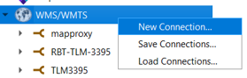
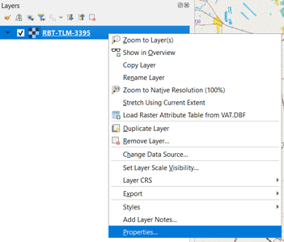
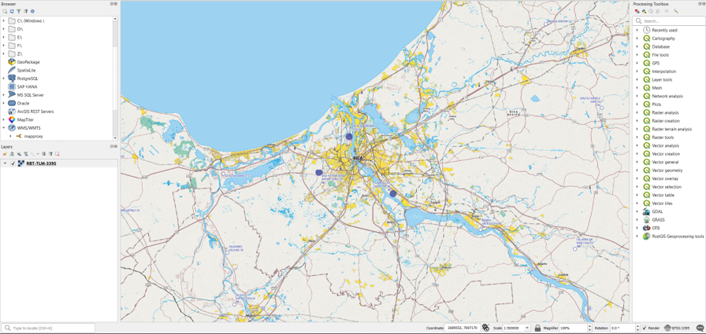
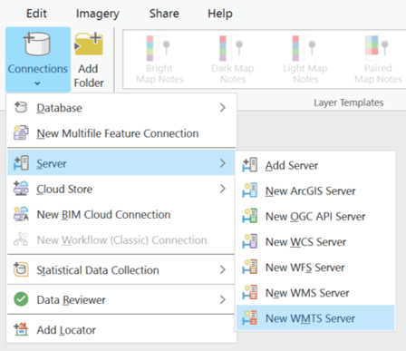
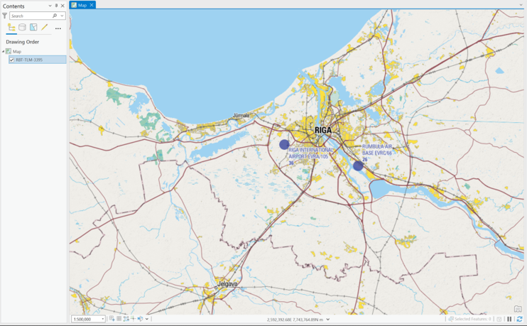

# Connecting to RBT WMTS Services

RBT provides two types of WMTS services:
1. **TileserverGL WMTS** - Dynamic vector tiles with multiple style options
2. **MapProxy WMTS** - Cached raster tiles with better performance

## Deployment Endpoints

### Local Docker Compose Deployment
- **TileserverGL**: `http://localhost:8081/tileservergl/`
- **MapProxy WMTS**: `http://localhost:8081/mapproxy/wmts/1.0.0/WMTSCapabilities.xml`

### Production Deployment
Replace `localhost:8081` with your production URL.

---

# CONNECTING TO MAPPROXY WMTS (Recommended for Performance)

## From QGIS

### 1. In QGIS, go to **Layer → Add Layer → Add WMS/WMTS Layer**

### 2. Click **New** to create a new connection

### 3. Enter the connection details:
   - **Name**: `RBT MapProxy WMTS`
   - **URL**: `http://localhost:8081/mapproxy/wmts/1.0.0/WMTSCapabilities.xml`
   - For production, replace `localhost:8081` with your deployment URL

### 4. Click **OK**, then click **Connect**

### 5. Select the available layers and click **Add**

### 6. The MapProxy layers will be added to your map with optimal caching performance

## From ArcGIS Pro

### 1. In the **Catalog** pane, right-click **Servers** and select **Add WMTS Server**

### 2. Enter the Server URL:
   - `http://localhost:8081/mapproxy/wmts/1.0.0/WMTSCapabilities.xml`
   - For production, replace `localhost:8081` with your deployment URL

### 3. Click **OK** to save the connection

### 4. Expand the WMTS server connection and drag the desired layer to your map

---

# CONNECTING TO TILESERVER-GL WMTS (For Style Flexibility)

## From QGIS

### 1. Open the TileserverGL interface:
   - Local: `http://localhost:8081/tileservergl/`
   - Production: Replace with your deployment URL

### 2. Find the style you want and right-click the **WMTS** button, then select **Copy Link Address**
   - Example URL: `http://localhost:8081/tileservergl/styles/RBT-TOPO/wmts.xml`

### 3. In QGIS, right-click **WMS/WMTS** in the Browser panel and select **New Connection**
   

### 4. Enter the connection details:
   - **Name**: Your chosen name (e.g., `RBT-TOPO`)
   - **URL**: The WMTS URL copied in step 2
   - **WMTS server-side tile pixel ratio**: Choose **High (192 DPI)** for better quality

   

### 5. Click **OK** to save the connection

### 6. Expand your new WMTS connection, right-click the layer, and select **Add Layer to Project**

   

### 7. (Optional) Improve rendering quality:
   - Right-click the layer in the Layers panel and select **Properties**

   
   - Go to **Symbology** tab
   - Set **Resampling** to **Bilinear** for both "Zoomed in" and "Zoomed out"
   - Click **OK**

   

### 8. You now have a WMTS basemap from TileserverGL!

   

## From ArcGIS Pro

### 1. Open the TileserverGL interface:
   - Local: `http://localhost:8081/tileservergl/`
   - Production: Replace with your deployment URL

### 2. Find the style you want and right-click the **WMTS** button, then select **Copy Link Address**

   

### 3. Click the **Connections** dropdown in the ArcGIS Pro ribbon, select **Server**, then click **New WMTS Server**

   

### 4. In the **Add WMTS Server Connection** dialog:
   - Paste the URL from Step 2 into **Server URL**
   - Click **OK**

   

### 5. In the **Catalog** pane:
   - Expand **Servers**
   - Right-click your new WMTS layer
   - Select **Add To New Map** or **Add To Current Map**

   

### 6. You now have a WMTS basemap from TileserverGL!

   

---

# Choosing Between MapProxy and TileserverGL WMTS

## Use MapProxy WMTS when:
- Performance is critical
- You need standard OGC-compliant WMTS
- You're working with older GIS clients
- You want cached tiles for offline use

## Use TileserverGL WMTS when:
- You need multiple style options
- You want the latest map updates immediately
- You need vector tile features
- You're working with modern GIS clients
- You prefer dynamic rendering

## Available Styles in TileserverGL

Available styles:
- **RBT-TOPO**: Topographic style
- **RBT-LIGHT**: Light basemap style
- **RBT-BROWN**: Brown/sepia basemap style
- **RBT-GRAY**: Grayscale basemap style
- **RBT-DARK**: Dark theme style
- **RBT-OVERLAY**: Overlay style for use with imagery

Visit the TileserverGL interface to see all available styles and their previews. Screenshots elsewhere in this guide may still show older `-3395` style identifiers (e.g. `RBT-TOPO-3395`) from a previous release that served an additional EPSG:3395 projection; those styles were renamed to drop the `-3395` suffix when this deployment moved to serving EPSG:3857 only.

## Troubleshooting

### Connection Failed
- Ensure Docker containers are running: `docker ps`
- Check if services are accessible in your browser
- Verify firewall settings allow connections on port 8081

### No Layers Available
- Ensure map data has been downloaded and mounted
- Check Docker logs: `docker compose logs`

### Slow Performance
- Use MapProxy WMTS for better caching
- Check your network connection
- Consider adjusting tile cache settings

### Projection Issues
- Both TileserverGL and MapProxy serve EPSG:3857 (Web Mercator), the standard projection used by most web maps
- Set your QGIS/ArcGIS project CRS to EPSG:3857 (or let the client reproject on the fly)